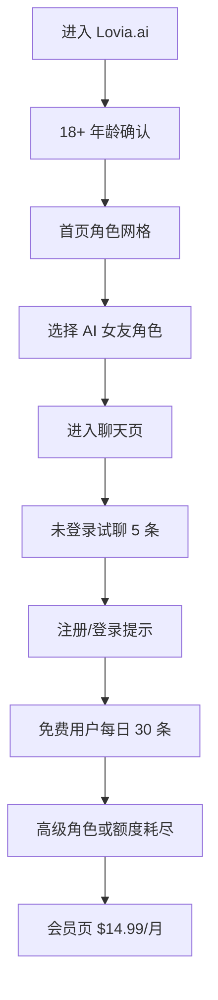

# Lovia.ai PRD

## 1. 产品概述
Lovia.ai 是一款英文优先、面向海外成年男性用户的 AI 女友陪伴网站。第一版目标是先完成高质量前端静态 MVP，让用户可以浏览角色、进入试聊、理解会员价值和成人内容边界。

- 核心目的：用角色卡片、自然恋爱聊天 UI、会员权益和私密陪伴氛围，验证产品方向。
- 目标价值：让用户在 30 秒内找到想聊天的 AI 女友，并在 5 条试聊内产生继续聊天或注册付费意愿。

## 2. 核心功能

### 2.1 用户角色
| 角色 | 注册方式 | 核心权限 |
|---|---|---|
| 未登录访客 | 无需注册 | 浏览角色、确认 18+、免费角色试聊 5 条 |
| 登录免费用户 | Google / 邮箱 / 用户名密码 | 每天 30 条消息、基础聊天历史、基础记忆 |
| 会员用户 | 订阅 $14.99/月 | 高级角色、无限聊天、每天 20 张图片、增强长期记忆 |

### 2.2 功能模块
1. **首页**：18+ 弹窗、Hero、角色网格、会员权益、产品卖点。
2. **角色列表页**：12 个预设角色、Free/Premium 标识、标签筛选视觉。
3. **角色详情页**：角色大图、人设介绍、标签、开始聊天 CTA。
4. **聊天页**：模拟聊天、5 条试聊限制、NSFW 状态、图片生成入口、升级提示。
5. **会员页**：$14.99/月、权益对比、升级 CTA。
6. **登录页**：Google、邮箱、用户名密码登录 UI。
7. **用户中心**：会员状态、聊天历史、长期记忆、NSFW 开关、数据删除入口。
8. **隐私/条款页**：18+、AI 内容、数据删除、禁止未成年人和真人冒充。

### 2.3 页面详情
| 页面名称 | 模块名称 | 功能描述 |
|---|---|---|
| 首页 | 年龄确认弹窗 | 首次访问展示 18+ 确认，localStorage 保存确认状态 |
| 首页 | Hero + 角色网格 | 英文文案、角色优先、Start Chatting CTA |
| 首页 | Featured AI Girlfriends | 展示部分角色卡片，区分 Free/Premium |
| 首页 | Free vs Premium | 展示免费与会员权益差异 |
| 角色列表页 | 角色网格 | 展示 12 个预设角色 |
| 角色详情页 | 角色档案 | 展示头像、简介、标签、开始聊天 |
| 聊天页 | 消息 UI | 前端 mock 回复，模拟 AI 女友对话 |
| 聊天页 | 额度提示 | 5 条后提示注册/升级 |
| 会员页 | 价格卡片 | $14.99/月，展示会员权益 |
| 用户中心 | 设置 | NSFW 开关、删除聊天、删除记忆、删除账号 UI |

## 3. 核心流程
用户首次进入 Lovia.ai，确认 18+ 后看到角色优先的首页。用户点击角色进入详情或直接进入聊天。未登录用户可以试聊 5 条，达到限制后引导注册或升级会员。会员页说明高级角色、无限聊天、每天 20 张图和增强记忆。

## 4. 用户界面设计

### 4.1 设计风格
- 主色：Midnight Plum `#130B1F`、Deep Ink `#08060D`
- 辅色：Velvet Rose `#B85C8E`、Soft Blush `#F6D7E6`
- 强调色：Electric Violet `#9B5CFF`、Champagne Mist `#F8EDEB`
- 按钮：大圆角胶囊按钮，柔光边缘，主 CTA 使用玫瑰到紫色渐变。
- 字体：展示字体采用优雅衬线风格，正文字体采用现代无衬线。
- 布局：深夜私密空间感，角色卡片优先，柔光、玻璃质感、轻微颗粒背景。
- 图标风格：克制线性图标，不使用夸张 emoji。

### 4.2 页面设计概览
| 页面名称 | 模块名称 | UI 元素 |
|---|---|---|
| 首页 | Hero | 深色背景、柔光角色卡、英文主标题、CTA |
| 首页 | 角色卡片 | 头像、标签、Premium 徽章、悬停柔光 |
| 聊天页 | 消息区 | 左右气泡、角色头像、输入框、额度提示 |
| 会员页 | 价格卡 | 单套餐、权益清单、强 CTA |
| 用户中心 | 设置卡片 | NSFW 开关、隐私控制、数据删除入口 |

### 4.3 响应式
- 采用桌面优先，同时移动端适配。
- 移动端首页优先展示 1 列角色卡片和固定底部 CTA。
- 聊天页移动端输入框固定底部，保证单手操作。
