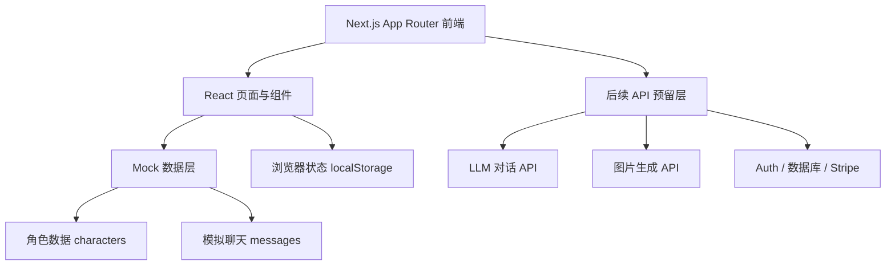
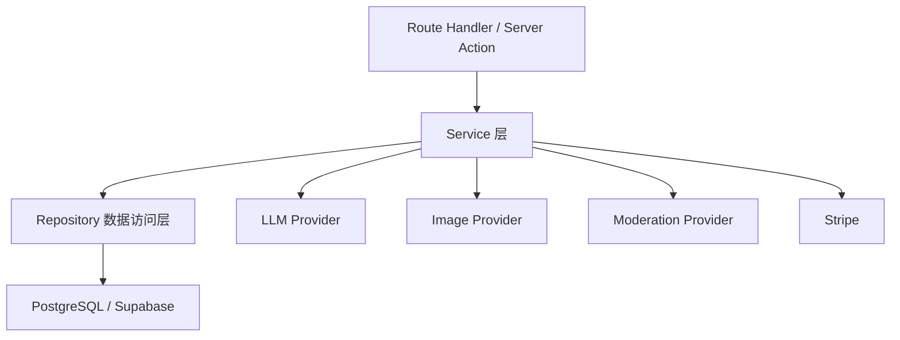
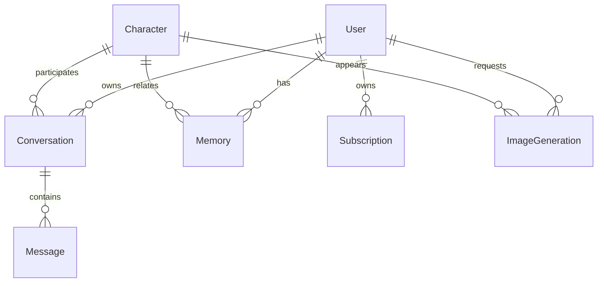

# Lovia.ai 技术架构文档

## 1. 架构设计



第一版只实现前端静态 MVP 与 mock 交互，不接真实后端、数据库、支付和 AI API。

## 2. 技术说明

- 前端框架：Next.js App Router
- UI 框架：React
- 语言：TypeScript
- 样式：Tailwind CSS
- 状态：React state + localStorage
- 数据：本地 mock 数据
- 初始化工具：create-next-app
- 设计要求：使用 frontend-design 风格，避免普通 SaaS 模板感

## 3. 路由定义

| 路由 | 用途 |
|---|---|
| `/` | 首页，含 18+ 弹窗、Hero、角色展示、会员入口 |
| `/characters` | 角色列表页 |
| `/characters/[id]` | 角色详情页 |
| `/chat/[characterId]` | 聊天页，第一版使用 mock 回复 |
| `/pricing` | 会员价格页 |
| `/login` | 登录/注册 UI |
| `/account` | 用户中心与设置 |
| `/privacy` | 隐私政策页 |
| `/terms` | 服务条款页 |

## 4. API 定义

第一版不实现真实 API，仅预留后续模块。

```ts
export type ChatRequest = {
  characterId: string
  messages: Message[]
  nsfwEnabled: boolean
}

export type ChatResponse = {
  message: Message
  usage?: {
    inputTokens: number
    outputTokens: number
  }
}

export type ImageGenerationRequest = {
  characterId: string
  prompt: string
  conversationId?: string
}

export type ImageGenerationResponse = {
  imageUrl: string
  status: 'completed' | 'failed' | 'pending'
}
```

后续可新增：

- `lib/ai/chat.ts`
- `lib/ai/image.ts`
- `lib/ai/moderation.ts`
- `lib/ai/memory.ts`
- `lib/auth/`
- `lib/billing/`
- `lib/db/`

## 5. 服务端架构图

第一版不做服务端。后续接入真实 API 后建议结构：



## 6. 数据模型

### 6.1 数据模型定义



### 6.2 TypeScript 数据定义

```ts
export type Character = {
  id: string
  name: string
  age: number
  avatarUrl: string
  description: string
  shortIntro: string
  personalityTags: string[]
  relationshipTags: string[]
  visualTags: string[]
  isPremium: boolean
  nsfwSupported: boolean
  systemPrompt: string
}

export type Message = {
  id: string
  conversationId?: string
  role: 'user' | 'assistant' | 'system'
  content: string
  type: 'text' | 'image'
  createdAt: string
}

export type UserPlan = 'guest' | 'free' | 'premium'
```

第一版仅创建 TypeScript 类型和 mock 数据，不创建数据库表。
